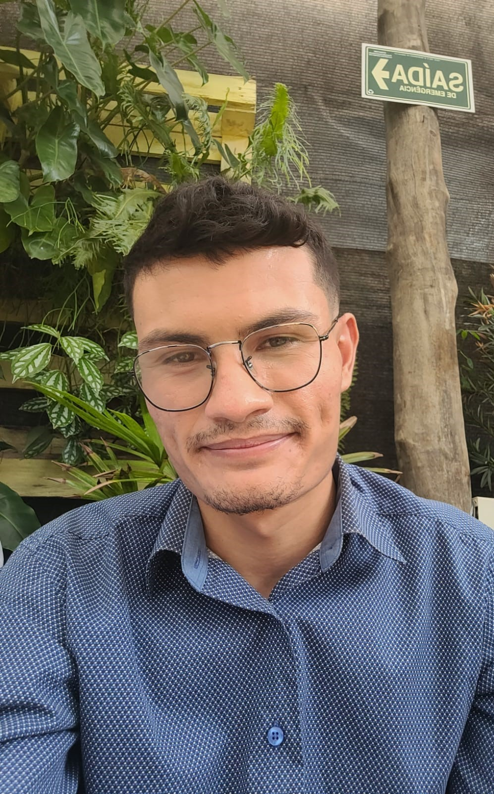

<h1 align="center">Portfólio Acadêmico</h1>

<table>
<tr>
<td>

## **Introdução**

Olá! Meu nome é **Brener**, tenho 25 anos e atualmente estou cursando o 6º semestre do curso de **Análise e Desenvolvimento de Sistemas** na **FATEC São José dos Campos – Prof. Jessen Vidal**.

Minha escolha por uma carreira em TI foi um processo gradual, influenciado pela curiosidade natural que sempre tive por computadores e tecnologia. Desde pequeno, adorava explorar o funcionamento das máquinas e descobrir como as coisas realmente funcionam. Quando surgiu a oportunidade de estudar na FATEC, percebi que seria um passo importante para direcionar meu interesse em tecnologia para algo mais concreto e útil.

Antes de me dedicar à programação, trabalhei em diversas áreas que, embora me proporcionassem aprendizado, não traziam a satisfação que eu buscava. Ao iniciar meus estudos na área de TI, especialmente em programação, percebi que estava finalmente no caminho certo. A tecnologia, para mim, vai além do uso diário; ela é uma ferramenta poderosa para resolver problemas reais e transformar a maneira como vivemos. Com o mercado em constante crescimento, senti que era o momento certo para me envolver e contribuir com meu conhecimento e habilidades, buscando sempre aprender e me adaptar às novas demandas do setor.

Experiência Profissional

**Especialista em Atendimento** (06/2022 – 11/2023) | **Atento Brasil**

- Abertura e gerenciamento de chamados de TI utilizando **BMC Remedy**.  
- Realização de vendas e trocas de planos através do sistema **CRM**.  
- Atuação como suporte técnico, fornecendo assistência aos clientes por meio dos softwares **CRM** e **Platon**.

**Auxiliar de TI** (01/2024 – 05/2024) | **Verone Art Decor**

- Direção de transmissões e gravações utilizando **vMix**.  
- Adição e atualização de produtos no site da empresa, utilizando a plataforma **WordPress**.  
- Criação de banners promocionais utilizando **Canva**.

  

</td>
<td>

</td>
</tr>
</table>

### **Contatos**

 

---

### **Principais Conhecimentos**

| **JavaScript**  | **Python**     | **Node.js**    | **MySQL**       | **PostgreSQL**  | **DBeaver**    | **Java**       | **Figma**       | **Canva**      |
|-----------------|----------------|----------------|-----------------|-----------------|----------------|----------------|-----------------|----------------|
|  |  |  |  |  |  |  |  |  |

## **2022 - 1º Semestre**

**Parceiro acadêmico - Fatec juntamente com o professor Antônio Egydio São Tiago Graça**

No primeiro semestre, sob a orientação do professor Antônio Egydio São Tiago Graça, fomos introduzidos ao projeto API (projeto integrador), no qual desenvolvemos um site de vagas de emprego. 

A Fatec São José dos Campos é uma faculdade pública voltada para cursos tecnológicos, com destaque para o API (projeto integrador), que conecta alunos a empresas parceiras. No API, as empresas apresentam desafios reais, e os alunos desenvolvem soluções em forma de software para resolver esses problemas. Essa parceria entre a Fatec e o mercado de trabalho proporciona uma experiência prática e prepara os estudantes para atender às demandas tecnológicas das indústrias da região.

**Projeto**

O projeto envolveu o desenvolvimento de um sistema web para facilitar a catalogação de vagas em diversas profissões, com um foco especial na área de TI. O objetivo era proporcionar aos usuários uma maneira eficiente de encontrar vagas de seu interesse, configurando métricas relacionadas a conhecimentos, habilidades e competências. O sistema foi projetado para apresentar essas informações de forma estratégica em gráficos, priorizando a usabilidade para um público diversificado em termos de idade e formação. 

Os requisitos definidos para a aplicação incluíam o uso das linguagens **Python**, **HTML** e **CSS**, além do framework **Bootstrap**. O projeto foi documentado em detalhes e disponibilizado no **GitHub**, abrangendo todos os processos necessários para atender às especificações do cliente. A estrutura do sistema deveria ter no mínimo cinco páginas: Página principal do projeto, Vagas de Emprego, Cursos e Certificações, Métricas (incluindo conhecimentos necessários, habilidades e requisitos), e Localização das vagas e cursos. Além disso, a apresentação do projeto foi realizada de forma presencial.

Você pode acessar o projeto [clicando aqui](https://github.com/LittleTech10/API--1-ADS)

**Resolução**

A resolução para o projeto envolveu o uso de Python em conjunto com Flask para realizar a raspagem de dados das vagas e cursos, permitindo a coleta e organização eficiente das informações. JavaScript foi empregado para gerar os gráficos e implementar filtros interativos, que facilitam a visualização e o ajuste das métricas, como conhecimentos e habilidades.
O desenvolvimento do sistema contou com uma forte colaboração da equipe, onde cada membro contribuiu com suas especialidades. Essa abordagem colaborativa resultou em uma solução robusta, documentada no GitHub e apresentada presencialmente, atendendo às expectativas do cliente e proporcionando uma experiência de usuário simplificada e eficiente.

---

### **Tecnologias Utilizadas**

| **Figma** | **VSCode** | **HTML** | **CSS** |
|:---------:|:----------:|:--------:|:-------:|
|  |  |  |  |
| Utilizado para desenvolver o protótipo apresentado ao cliente. | Utilizado para o desenvolvimento do código de todo o projeto. | Utilizado para a criação da estrutura do catálogo de vagas. | Utilizado para estilizar e melhorar a apresentação visual das páginas criadas com HTML, controlando cores, fontes e layout. |
| **Git** | **GitHub** | **Python** | **JavaScript** |
|  |  |  |  |
| Utilizado para gerenciar e controlar as versões do código-fonte de forma eficiente, possibilitando colaboração, rastreamento de alterações e tornando o desenvolvimento mais organizado. | Utilizado para a hospedagem do código-fonte, facilitando o trabalho em equipe, oferecendo controle de versão eficiente e permitindo o gerenciamento dos colaboradores. | Utilizado para a raspagem de dados (Web-Scraping) das vagas de emprego e dos cursos pela internet. | Utilizado para criar gráficos que mostram dados sobre as vagas catalogadas no site. |

---

### **Contribuições**

Contribuí significativamente para a criação das páginas do sistema, utilizando **HTML**, **CSS**, **Bootstrap** e **JavaScript**. Fiquei responsável pelo desenvolvimento da barra de pesquisa, implementada com JavaScript para garantir uma busca eficiente e intuitiva. Além disso, participei na raspagem de dados utilizando **Python**, o que foi essencial para a coleta e integração das informações no sistema.

---

### **Hard Skills**

**Desenvolvimento Web:** Utilização de **HTML5** e **CSS3** para contribuir efetivamente no projeto.
**JavaScript:** Implementação de funcionalidades como a barra de pesquisa, com foco em melhorar a interatividade e a experiência do usuário.
**Raspagem de Dados:** Conhecimento básico em **Python** para a realização de raspagem de dados, incluindo técnicas fundamentais para extrair e integrar informações de sites.

---

### **Soft Skills**

Durante o projeto, atuei como desenvolvedor e participei ativamente das sprints, onde tarefas foram atribuídas a cada membro com base no backlog do produto. Concluí minhas tarefas dentro dos prazos estabelecidos, o que foi crucial para aprimorar minhas habilidades de gerenciamento de tempo e garantir a eficiência nas entregas. Essa experiência foi fundamental para melhorar minha capacidade de organizar e gerenciar minhas atividades de maneira produtiva.

Além disso, estive envolvido nas reuniões regulares, nas quais discutíamos e alinhávamos os próximos passos do projeto. Essas reuniões foram essenciais para promover uma comunicação clara e garantir um trabalho em equipe eficiente. A participação ativa nesses encontros fortaleceu minhas habilidades de colaboração e adaptabilidade em um ambiente ágil, permitindo-me contribuir de forma mais eficaz para o sucesso do projeto.

## **2022 - 2º Semestre**  
### **Parceiro Acadêmico – TrackCash**

A **TrackCash** é uma empresa especializada em gestão financeira, dedicada a ajudar empresas de diferentes portes e setores a organizar e otimizar suas finanças. Focada em soluções B2B, a TrackCash oferece uma plataforma que facilita a conciliação de vendas e pagamentos provenientes de diversas fontes, como e-commerce, marketplaces e lojas físicas. Com um painel intuitivo, seus clientes podem visualizar e gerenciar todas as transações financeiras de forma centralizada, garantindo mais controle e eficiência na administração de suas operações comerciais.

---

### **Projeto:**
Desenvolvemos um **aplicativo mobile** com o objetivo de criar um **CRUD** para atender à demanda dos clientes, que são vendedores de lojas online e físicas. O foco principal era facilitar o processo de conciliação financeira, permitindo que a aplicação autorizasse o acesso da empresa aos dados financeiros dos clientes. Assim, garantimos uma gestão mais eficiente e automatizada das conciliações entre vendas e pagamentos.

[Você pode acessar o projeto clicando aqui.](https://github.com/TechForce-ADS/TrackCash)

---

### **Resolução:**
O desenvolvimento em equipe resultou na criação de um **aplicativo mobile intuitivo** que permite aos clientes concederem autorização para a **TrackCash** acessar APIs e planilhas automatizadas. Com essa autorização, a TrackCash pode oferecer suporte avançado nas questões de vendas e finanças das empresas, proporcionando um sistema seguro e bem estruturado que integra e otimiza a gestão financeira.

---

### **Tecnologias Utilizadas:**

| **Java** | **Java Swing** | **NetBeans** | **MySQL** | **Canva** |
|:---------:|:--------------:|:------------:|:---------:|:--------:|
|  |  |  |  |  |
| Linguagem de programação principal do projeto. | Conjunto de bibliotecas e ferramentas para a construção da interface gráfica. | Ambiente de Desenvolvimento Integrado (IDE) utilizado para programação. | Sistema de gerenciamento de banco de dados. | Ferramenta utilizada para prototipação de designs. |
| **Pacote Office** | **Git** | **GitHub** | **Discord** | **Slack** |
|  |  |  |  |  |
| Utilizado para a gestão da equipe e documentação. | Ferramenta para versionamento de código. | Plataforma para armazenamento do projeto e registro da documentação. | Ferramenta de comunicação interna da equipe. | Ferramenta de comunicação entre o Product Owner e o cliente. |

---

### **Contribuições:**
Durante o projeto, foquei no desenvolvimento, com ênfase nas funções de **backend** e no gerenciamento do **banco de dados**. Participei das reuniões semanais para alinhar o progresso com a equipe e atendi às solicitações do Scrum Master, conforme as necessidades do projeto.

---

### **Hard Skills:**
- **Desenvolvimento Mobile**: Utilização de **Java** para a criação de funcionalidades e a implementação do backend do aplicativo.  
- **Documentação**: Registro e versionamento do código através do **GitHub**, garantindo o controle das alterações e a colaboração eficiente.  
- **Banco de Dados**: Gerenciamento e estruturação de dados utilizando **MySQL**, assegurando a integridade e a acessibilidade das informações.

---

### **Soft Skills:**
Durante o projeto, desenvolvi habilidades importantes, incluindo:

- **Comunicação eficaz**: Participei ativamente das reuniões semanais para alinhar o progresso com a equipe e garantir que todos estivessem cientes das metas e dos requisitos.
- **Colaboração em equipe**: Trabalhei em conjunto com os membros da equipe para integrar as diferentes partes do sistema e atender às solicitações do Scrum Master.
- **Gestão de tempo**: Priorização e organização das tarefas de desenvolvimento para cumprir prazos e metas.
- **Adaptabilidade**: Lidei com mudanças de requisitos e ajustes nas especificações do projeto.
- **Resolução de problemas**: Identifiquei e resolvi desafios técnicos durante o desenvolvimento do backend e a manipulação de dados.

## 2023 - 1º Semestre

### Parceiro Acadêmico: Visiona

A **Visiona Tecnologia Espacial** é uma joint-venture entre a Embraer Defesa & Segurança e a Telebras, voltada para a integração de sistemas espaciais e a prestação de serviços baseados em satélites. A companhia atende aos objetivos do Programa Espacial Brasileiro e às demandas de mercado.

---

### Projeto

Desenvolvemos uma **aplicação web** para gerenciamento de usuários, incorporando autenticação e autorização para acesso a diversos serviços. O sistema foi projetado para gerenciar diferentes perfis de usuários com permissões específicas e criar dashboards personalizados com dados gerais do sistema. Ele permite a adição, edição, exclusão e visualização de contas, garantindo uma gestão eficiente e segura dos dados e permissões de acesso.

[Você pode acessar o projeto clicando aqui.](https://github.com/TechForce-ADS/Visiona)

---

### Resolução

Desenvolvemos uma interface de gerenciamento intuitiva que segue os parâmetros fornecidos pelo cliente. A aplicação permite listar, adicionar, deletar e editar usuários, além de atribuir permissões específicas a cada um.

---

### Tecnologias Utilizadas

| **Node**              | **JavaScript**         | **React**            | **TypeScript**        |
|:---------------------:|:----------------------:|:--------------------:|:---------------------:|
|  |  |  |  |
| Ambiente de execução para desenvolvimento do back-end. | Linguagem de programação principal utilizada para a construção de funcionalidades. | Biblioteca para desenvolvimento da interface do usuário no front-end. | Linguagem auxiliar para adicionar tipagem estática e melhorar a robustez do código. |
| **PostgreSQL**        | **DBEaver**           | **Canva**             | **Pacote Office**     |
|  |  |  |  |
| Sistema de gerenciamento de banco de dados. | Ferramenta para gerenciamento e visualização de bancos de dados. | Ferramenta para prototipação de designs e layouts. | Utilizado para gestão da equipe e documentação do projeto. |
| **Git**               | **GitHub**            | **Discord**           | **Slack**             |
|  |  |  |  |
| Sistema de versionamento de código. | Plataforma para armazenamento do projeto e registro da documentação. | Ferramenta de comunicação para interação entre os membros da equipe. | Ferramenta de comunicação entre o Product Owner e o cliente. |

---

### Contribuições

Concentrei-me principalmente no desenvolvimento do **back-end** e na estruturação do **banco de dados**, garantindo uma base sólida e eficiente para a aplicação. Participei da análise de requisitos, testes e debug, assegurando que todas as funcionalidades estivessem em pleno funcionamento até a entrega do projeto.

---

### Hard Skills

- **VSCode:** Ambiente principal para a gestão e desenvolvimento de código.
- **Node.js:** Utilizado para o desenvolvimento do back-end.
- **React:** Desenvolvimento da interface no front-end.
- **JavaScript:** Implementação das funcionalidades do back-end.
- **Sequelize:** Manipulação e consulta de dados com PostgreSQL.
- **Insomnia:** Teste das APIs.
- **DBEaver:** Visualização e gerenciamento dos dados.

---

### Soft Skills

- **Colaboração em equipe:** Trabalhei de forma constante com os outros membros, atendendo às solicitações do Scrum Master.
- **Comunicação clara:** Participei de reuniões semanais para alinhar o progresso do time.
- **Gestão de tempo:** Organizei minhas tarefas de forma eficiente para atender os prazos.
- **Resolução de problemas:** Envolvimento na identificação e correção de bugs.
- **Adaptabilidade:** Trabalhei com tecnologias novas e métodos aprimorados.

---

## 2023 - 2º Semestre

### Parceiro Acadêmico: Grenneat

A **Grenneat** é uma empresa dedicada à criação de produtos de limpeza sustentáveis, com foco em promover a sustentabilidade e integrar práticas de economia circular.

---

### Projeto

Desenvolvemos um sistema web com regras de negócio complexas, focado na economia circular e voltado para o gerenciamento da reciclagem de óleo vegetal. O sistema permite que os usuários troquem créditos acumulados por produtos de limpeza na loja virtual da Grenneat.

[Você pode acessar o projeto clicando aqui.](https://github.com/TechForce-ADS/Greenneat)

---

### Resolução

A plataforma incentiva a reciclagem por meio de um sistema de créditos, onde estabelecimentos cadastrados acumulam créditos ao descartar corretamente o óleo vegetal usado e podem adquirir produtos na loja virtual da Grenneat, promovendo um ciclo de economia circular.

---

### Tecnologias Utilizadas

| **Node.js**          | **JavaScript**         | **React**            | **MySQL**            | **Canva**             |
|:---------------------:|:----------------------:|:--------------------:|:--------------------:|:---------------------:|
|  |  |  |  |  |
| Ambiente de execução para desenvolvimento do back-end. | Linguagem de programação utilizada no front-end e back-end. | Biblioteca para desenvolvimento do front-end. | Banco de dados para armazenar as informações. | Ferramenta para prototipação. |
| **Pacote Office**     | **Git**               | **GitHub**           | **Discord**          | **Slack**             |
|  |  |  |  |  |
| Gestão da equipe.     | Controle de versionamento do código. | Armazenamento do projeto e registro de documentação. | Comunicação da equipe. | Comunicação entre Product Owner e cliente. |

---

### Contribuições

Contribuí significativamente para o desenvolvimento do **front-end** utilizando React, criando uma interface interativa. No **back-end**, trabalhei com JavaScript e participei da análise de requisitos, testes e manutenção do software.

---

### Hard Skills

- **REST:** Teste de APIs para garantir funcionamento.
- **Node.js:** Desenvolvimento do back-end.
- **JavaScript:** Criação das funções e lógica da aplicação.
- **GitHub:** Controle de versão e armazenamento do código.
- **React:** Desenvolvimento da interface visual.
- **MySQL e Sequelize:** Criação e gerenciamento do banco de dados.

---

### Soft Skills

- **Colaboração em equipe:** Trabalhei eficazmente com outros membros.
- **Comunicação clara:** Melhorei a objetividade nas interações.
- **Gestão de tempo:** Organizei prazos e prioridades.
- **Resolução de problemas:** Identifiquei e resolvi desafios técnicos.

